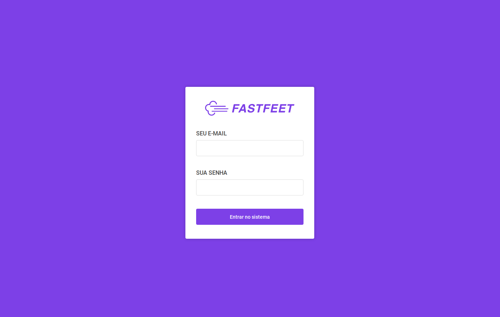
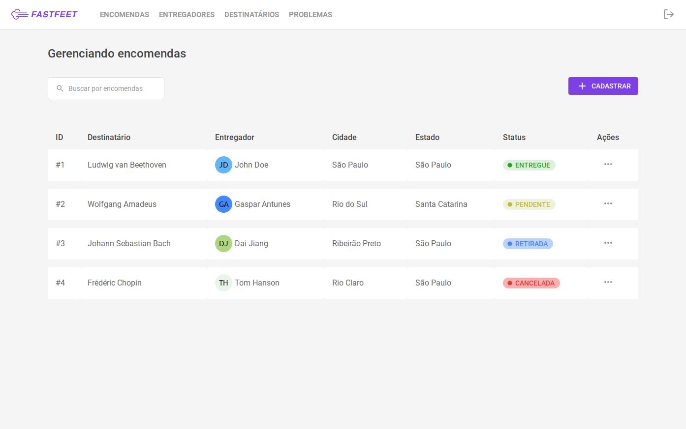

<h1 align="center">
  
   
</h1>

 

  

 

  

 
<h2>FastFeet</h2>
 

  Aplicação para uma transportadora fictícia, o FastFeet.

 
 Quer ver uma demonstração? Acesse: <a href="https://webfastfeet.netlify.app" target="_blank" rel="noopener noreferrer">webfastfeet.netlify.app</a>
 
 
 
Você pode usar esses dados:
 
 
<strong>Usuário:</strong> admin@fastfeet.com
 
<strong>Senha:</strong> adminfastfeet
 
 
 
 

<h3>Repositórios</h3>
 

- [Api backend](https://github.com/kilsonrs/fastfeet-api)
- [Web client](https://github.com/kilsonrs/fastfeet-web)
- [App client](https://github.com/kilsonrs/fastfeet-app)

 
 
 

<h3>License</h3>

This project is licensed under the MIT License - see the [LICENSE](LICENSE) file for details.

---

Kilson 👋 &nbsp;[See my linkedin](https://www.linkedin.com/in/kilsonrs/)

